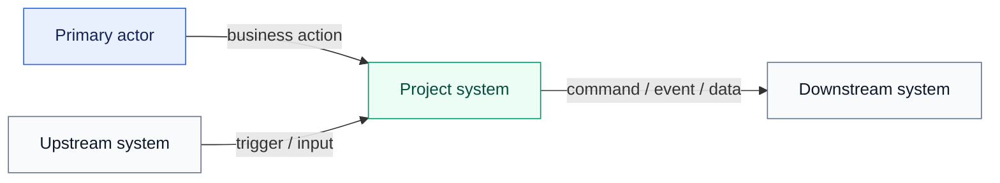
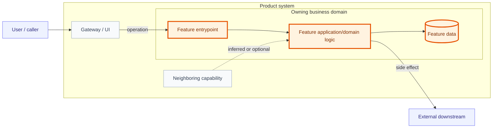
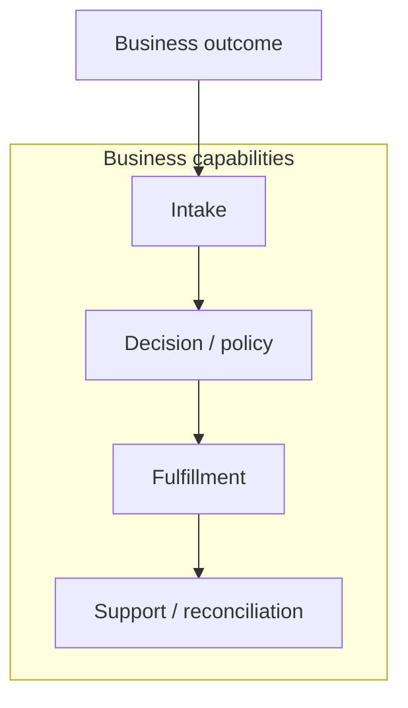
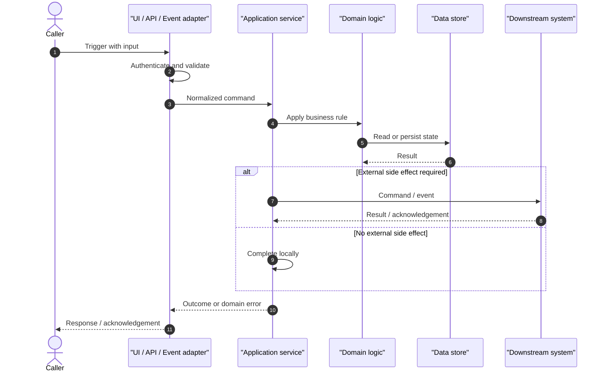
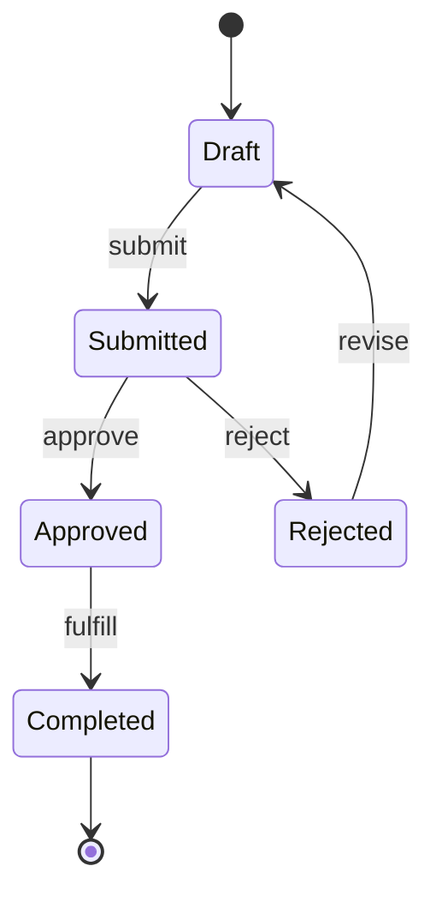

# Diagram Patterns

Use these patterns as starting points. Replace placeholders with project terminology and omit diagrams that do not add explanatory value.

## Contents

1. Diagram rules
2. System context
3. Focused component map
4. Business capability map
5. Feature sequence
6. State lifecycle

## Diagram rules

- Quote Mermaid labels that contain spaces, punctuation, or parentheses.
- Use stable domain names consistently across diagrams and report tables.
- Show direction on every integration and label the protocol, operation, topic, or data when known.
- Keep infrastructure and business components visually distinct.
- Use solid edges for confirmed relationships. Use dashed edges only for useful, explicitly labeled inferences.
- Put evidence citations in prose immediately below a diagram; do not crowd source paths into nodes.
- Add a legend when using focus or inferred styling.
- Validate that Mermaid parses before delivery when a renderer is available.

## System context

Below the diagram, list the evidence for each edge and mark any inferred direction.

## Focused component map

Use this pattern whenever the user requests one feature or module. The orange nodes show exactly where the requested feature lives in the wider system.

Add a location statement after the diagram:

`Product system > Owning domain > Service/package > Feature module > Entrypoint`

## Business capability map

Map each capability to implementing components in a table below the diagram. Do not derive capability boundaries solely from folders.

## Feature sequence

Replace generic steps with verified behavior. Include timeout, retry, transaction, or async boundaries only when supported by evidence.

## State lifecycle

Use a state diagram only when state and transitions are explicit in code, schemas, or authoritative documentation. Note guards, side effects, and irreversible transitions in prose.
